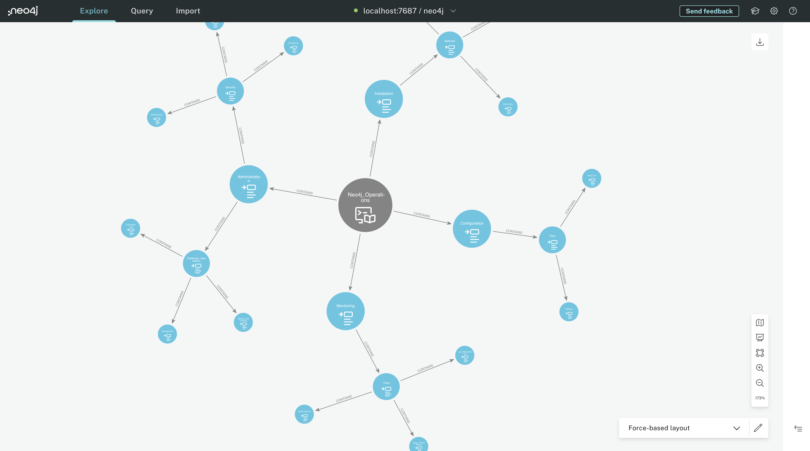

# neo4jopsgraph
See Neo4j Operations as a graph

## Description
From a JSON file obtained from GPT-4, prompted to describe Neo4j Operations Guide...  
We get a knowledge graph of what are Neo4j operations. (Installation, Configuration, Monitoring, Administration, Perofmrance Optimization)

## How-to
* Create Aura database on https://console.neo4j.io
* Import CSV file from `cypher` directory 
* Play Cypher queries in `Query` tab
* Go to `Explore` tab. Import perspective from `bloom` directory
* Visualize knowledge graph in Neo4j Bloom